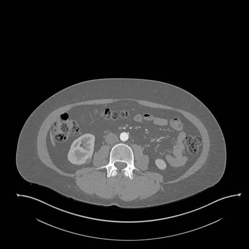
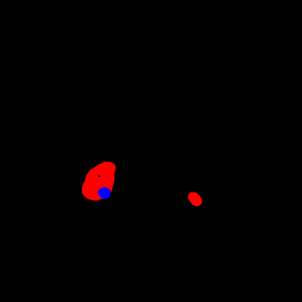
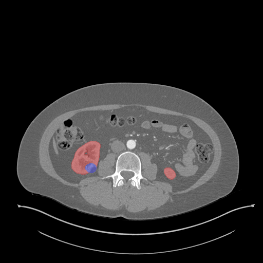
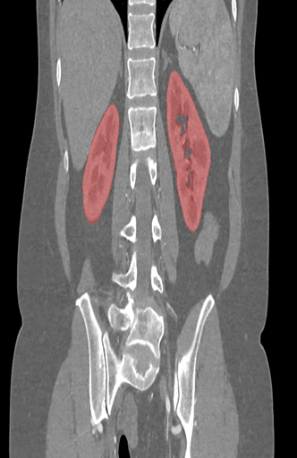
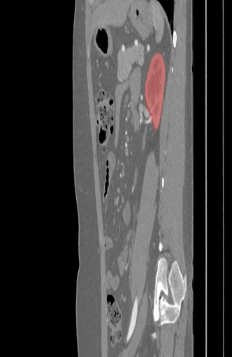

# KiTS19

The official [2019 KiTS Challenge](https://kits19.grand-challenge.org) repository.

## Usage

To get the data for this challenge, please clone this repository (~500MB), and then run `get_imaging.py`. For example
```text
git clone https://github.com/neheller/kits19
cd kits19
pip3 install -r requirements.txt
python3 -m starter_code.get_imaging
```
This will download the much larger and static image files from a separate source. The `data/` directory should then be structured as follows

```
data
├── case_00000
|   ├── imaging.nii.gz
|   └── segmentation.nii.gz
├── case_00001
|   ├── imaging.nii.gz
|   └── segmentation.nii.gz
...
├── case_00209
|   ├── imaging.nii.gz
|   └── segmentation.nii.gz
└── kits.json
```

We've provided some basic Python scripts in `starter_code/` for loading and/or visualizing the data. 

### Loading Data

```python
from starter_code.utils import load_case

volume, segmentation = load_case("case_00123")
# or
volume, segmentation = load_case(123)
```

Will give you two `Nifty1Image`s. Their shapes will be `(num_slices, height, width)`, and their pixel datatypes will be `np.float32` and `np.uint8` respectively. In the segmentation, a value of 0 represents background, 1 represents kidney, and 2 represents tumor.

For information about using a `Nifty1Image`, see the [Nibabel Documentation](https://nipy.org/nibabel/manual.html#manual) ([Getting Started](https://nipy.org/nibabel/gettingstarted.html))

### Visualizing Data

The `visualize.py` file will dump a series of PNG files depicting a case's imaging with the segmentation label overlayed. By default, red represents kidney and blue represents tumor.

From Bash:

```bash
python3 starter_code/visualize.py -c case_00123 -d <destination>
# or
python3 starter_code/visualize.py -c 123 -d <destination>
```

From Python:

```python
from starter_code.visualize import visualize

visualize("case_00123", <destination (str)>)
# or
visualize(123, <destination (str)>)
```

### Voxel Spacing

Each `Nift1Image` object has an attribute called `affine`. This is a 4x4 matrix, and in our case, it takes the value
```
array([[0.                          , 0.                      , -1*captured_pixel_width , 0. ],
       [0.                          , -1*captured_pixel_width , 0.                      , 0. ],
       [-1*captured_slice_thickness , 0.                      , 0.                      , 0. ],
       [0.                          , 0.                      , 0.                      , 1. ]])
```
This information is also available in `data/kits.json`. Since this data was collected during routine clinical practice from many centers, these values vary quite a bit.

Since spatially inconsistent data might not be ideal for machine learning applications, we have created a branch called `interpolated` with the same data but with the same affine transformation for each patient.
```
array([[ 0.        ,  0.        , -0.78162497,  0.        ],
       [ 0.        , -0.78162497,  0.        ,  0.        ],
       [-3.        ,  0.        ,  0.        ,  0.        ],
       [ 0.        ,  0.        ,  0.        ,  1.        ]])
```

## Use notebook to visualize slices

```python
import numpy as np 
from starter_code.visualize import nb_visualize, get_vol_seg_ims
from PIL import Image
```

```python
plane = ["axial", "coronal", "sagittal"]
cid = "case_00000"
```

```python
vol, seg, vol_ims, seg_ims = get_vol_seg_ims(cid)
```

## Shape of voxel

```python
print("Voxel shape:{}".format(vol_ims.shape))
```

    Voxel shape:(611, 512, 512, 3)


```python
index = 300
slice_image = vol_ims[index].astype('uint8')
print("Shape of slice:{}".format(slice_image.shape))
Image.fromarray(slice_image, 'RGB')
```

    Shape of slice:(512, 512, 3)





```python
slice_image = seg_ims[index].astype('uint8')
print("Kidney:{:.4f}%".format(np.sum((seg_ims[index][:,:,0].astype('uint8') == 255))/(slice_image.shape[0]*slice_image.shape[1])))
print("Tumor:{:.4f}%".format(np.sum((seg_ims[index][:,:,2].astype('uint8') == 255))/(slice_image.shape[0]*slice_image.shape[1])))
Image.fromarray(slice_image, 'RGB')
```

    Kidney:0.0110%
    Tumor:0.0013%





## Get axial slices


```python
viz_imgs_axial = nb_visualize(cid, ".", plane=plane[0])
print("viz_imgs_axial shape:{}".format(viz_imgs_axial.shape))
```

    viz_imgs_axial shape:(611, 512, 512, 3)


## Get coronal slices


```python
viz_imgs_coronal = nb_visualize(cid, ".", plane=plane[1])
print("viz_imgs_coronal shape:{}".format(viz_imgs_coronal.shape))
```

    viz_imgs_coronal shape:(512, 512, 332, 3)


## Get sagittal slices


```python
viz_imgs_sagittal = nb_visualize(cid, ".", plane=plane[2])
print("viz_imgs_sagittal shape:{}".format(viz_imgs_sagittal.shape))
```

    viz_imgs_sagittal shape:(512, 512, 332, 3)


## Visualize


```python
axial_slice_index = 300
Image.fromarray(viz_imgs_axial[axial_slice_index].astype(np.int8), 'RGB')
```





```python
coronal_slice_index = 340
Image.fromarray(viz_imgs_coronal[coronal_slice_index].astype(np.int8), 'RGB')
```





```python
sagittal_slice_index = 300
Image.fromarray(viz_imgs_sagittal[sagittal_slice_index].astype(np.int8), 'RGB')
```





## Labeling Errors

We've gone to great lengths to produce the best segmentation labels that we could. That said, *we're certainly not perfect*. In an attempt to strike a balance between quality and stability, we've decided on the following policy: 

If you find an problem with the data, please [submit an issue](https://github.com/neheller/kits19/issues/new) describing it. 

## Challenge Results

The KiTS19 challenge was held in conjunction with MICCAI 2019 in Shenzhen, China. The official leaderboard for the challenge can be found [here](http://results.kits-challenge.org/miccai2019/), and the live leaderboard for new submissions can be found [on grand-challenge.org](https://kits19.grand-challenge.org/evaluation/results/). A paper describing the results and conclusions of the challenge is under review at Medical Image Analysis. A preprint can be found [on arxiv](https://arxiv.org/abs/1912.01054) and is citable as
```
@article{heller2019state,
  title={The state of the art in kidney and kidney tumor segmentation in contrast-enhanced CT imaging: Results of the KiTS19 Challenge},
  author={Heller, Nicholas and Isensee, Fabian and Maier-Hein, Klaus H and Hou, Xiaoshuai and Xie, Chunmei and Li, Fengyi and Nan, Yang and Mu, Guangrui and Lin, Zhiyong and Han, Miofei and others},
  journal={arXiv preprint arXiv:1912.01054},
  year={2019}
}
```

### Reference

An in-depth description of how this data was collected and annotated can be found on arxiv [here](https://arxiv.org/abs/1904.00445). If this data is useful to your research, please cite this as
```
@misc{1904.00445,
Author = {Nicholas Heller and Niranjan Sathianathen and Arveen Kalapara and Edward Walczak and Keenan Moore and Heather Kaluzniak and Joel Rosenberg and Paul Blake and Zachary Rengel and Makinna Oestreich and Joshua Dean and Michael Tradewell and Aneri Shah and Resha Tejpaul and Zachary Edgerton and Matthew Peterson and Shaneabbas Raza and Subodh Regmi and Nikolaos Papanikolopoulos and Christopher Weight},
Title = {The KiTS19 Challenge Data: 300 Kidney Tumor Cases with Clinical Context, CT Semantic Segmentations, and Surgical Outcomes},
Year = {2019},
Eprint = {arXiv:1904.00445},
}
```
